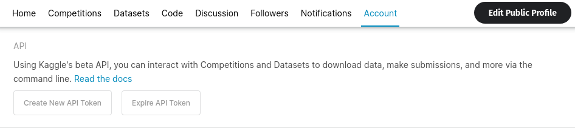

# QuickFixes

All minor issues I've faced and their solutions. Also contains things that I usually forget.

- [QuickFixes](#quickfixes)
    - [**PyTorch**](#pytorch)
    - [**MatPlotLib**](#matplotlib)
    - [**Kaggle-Colab**](#kaggle-colab)

### **PyTorch**

> To select Device automatically

```python
DEVICE = "cuda" if torch.cuda.is_available() else "cpu"
```

> TQDM iteration prints on new line. To fix this change the import statement to

```
from tqdm.auto import tqdm
```

### **MatPlotLib**

> To change figure size

```python
fig = plt.figure(figsize(width, height))
```

> Subplots, axis removal, title, plotting

```python
fig.add_subplot(MAX_ROWS, MAX_COLUMNS, index)
plt.axis("off")
plt.title("Title for the subplot")
plt.imshow(image_to_be_plotted)
```

### **Kaggle-Colab**

> To download dataset onto colab follow the steps given below :

1. Go to your kaggle account and click on the _create new API token_ button and save the _kaggle.json_ file created.
   

2. Run the code given below in a cell on your notebook and upload the _kaggle.json_ file when promted to.

```python
!pip install -q kaggle

from google.colab import files
files.upload()


!mkdir ~/.kaggle
!cp kaggle.json ~/.kaggle/
!chmod 600 ~/.kaggle/kaggle.json

# dataset-link example : dhruvildave/spotify-charts
!kaggle datasets download -d <dataset-link>
!unzip dataset.zip -d dataset
```
